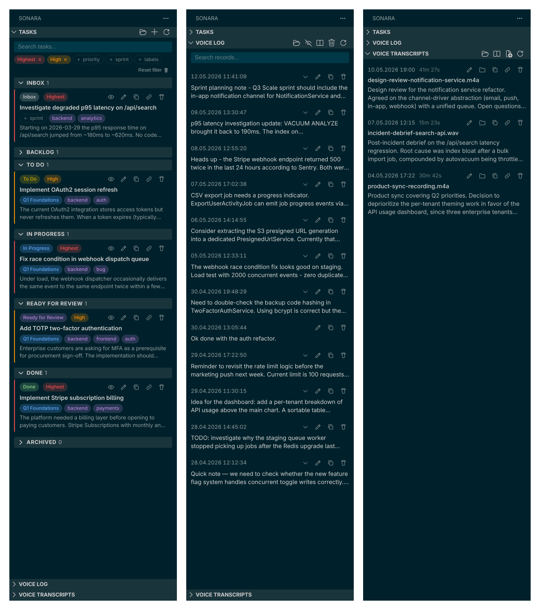

# Sonara

Two productivity modules in one VS Code extension: task management as markdown files and local voice input via Whisper.



## Features

### Tasks

Manage project tasks as plain markdown files — no external service, no account required. Tasks travel with your repository.

- One markdown file per task with YAML frontmatter metadata
- Fields: title, status, priority, sprint, labels, created, updated
- Webview panel groups tasks by status: Activity, Inbox, Backlog, To Do, In Progress, Review, Done, Released, Cancelled
- Five priority levels: Highest, High, Medium, Low, Lowest
- Filter by sprint, label, and priority directly in the panel
- Create, edit, and delete tasks without leaving VS Code
- Tasks stored under `.vscode/sonara/tasks/` — commit them alongside your code or keep them local

### Voice

Dictate notes, prompts, and task descriptions using a local Whisper model. Audio is processed entirely on your machine.

- Start and stop recording with a single keyboard shortcut
- Live transcription streamed to the Voice Log as you speak
- Voice Log persisted as JSONL — search, copy, and export entries
- Project-specific vocabulary file biases Whisper toward your technical terms
- Supports GPU acceleration (CUDA) for fast transcription on capable hardware
- No network connection required during recording or transcription

### Voice Transcripts

Transcribe pre-recorded audio files (meetings, debriefs, design reviews) into searchable markdown.

- Right-click any audio file or use `Sonara: Transcribe File...` from the command palette
- Each transcript saved as a markdown file under `.vscode/sonara/voice-transcripts/`
- Metadata header captures source filename, duration, language, and creation date
- Summary section above the transcript body for a quick overview
- Webview panel lists all transcripts with timestamps and durations

## Quick Start

### Install

1. Download the latest `.vsix` file from the [Releases](../../releases) page (or install from the VS Code Marketplace when available).
2. In VS Code: `Extensions` - `...` - `Install from VSIX` - select the downloaded file.
3. Reload VS Code when prompted.

### Open the sidebar

Click the Sonara icon in the Activity Bar (checklist icon). Three views appear: **Tasks**, **Voice Log**, and **Voice Transcripts**.

### Initialize Tasks for a project

1. Open a workspace folder.
2. Run `Tasks: Initialize for This Project` from the Command Palette (`Ctrl+Shift+P`).
3. A `.vscode/sonara/tasks/` directory is created with a welcome task and a README describing the file format.

### Start recording

1. Run `Voice: Setup` from the Command Palette to download the Whisper model (first-time only).
2. Press `Ctrl+Shift+M` to start recording.
3. Speak. The transcription appears live in the Voice Log.
4. Press `Ctrl+Shift+M` again to stop and save the entry.

## Tasks File Format

Each task is a `.md` file under `.vscode/sonara/tasks/`. The file starts with a YAML frontmatter block followed by free-form markdown content.

```markdown
<!-- Sonara task. Format and rules: .vscode/sonara/tasks/README.md -->
---
title: Implement OAuth2 session refresh
status: in-progress
priority: high
created: 2026-04-08T09:00:00Z
updated: 2026-04-10T16:45:00Z
sprint: Q2 Growth
labels: [backend, auth]
---

Task description in free-form markdown.
```

| Field | Required | Values |
|-------|----------|--------|
| `title` | No (filename used as fallback) | Any string |
| `status` | No (null if omitted or invalid) | `activity`, `inbox`, `backlog`, `todo`, `in-progress`, `review`, `done`, `released`, `cancelled` |
| `priority` | No (defaults to `medium`) | `highest`, `high`, `medium`, `low`, `lowest` |
| `created` | No | ISO 8601 date string |
| `updated` | No | ISO 8601 date string |
| `sprint` | No | Any string |
| `labels` | No | YAML array of strings |

See `.vscode/sonara/tasks/README.md` inside any initialized project for the full specification.

## Voice Setup

Sonara bundles a Python server that runs [faster-whisper](https://github.com/guillaumeklebs/faster-whisper) locally. On first use, the server downloads the selected Whisper model to your machine.

- **No internet required** during recording or transcription - only during the initial model download.
- **GPU support**: if a CUDA-capable GPU is detected, transcription runs on the GPU automatically. CPU fallback is used otherwise.
- **Vocabulary**: edit `.vscode/sonara/voice-log/vocabulary.md` in your project to list technical terms, proper names, and project-specific jargon. Whisper will be biased toward recognizing these words. Keep the list under 150 terms.

Keyboard shortcuts:

| Shortcut | Action |
|----------|--------|
| `Ctrl+Shift+M` | Start / stop recording |
| `Ctrl+Alt+M` | Cancel recording (discard audio) |

## Configuration

All settings are namespaced under `sonara.voice.*`. Open VS Code Settings (`Ctrl+,`) and search for `sonara` to see the full list. Key options:

| Setting | Default | Description |
|---------|---------|-------------|
| `sonara.voice.model` | `base` | Whisper model size (`tiny`, `base`, `small`, `medium`, `large-v3`) |
| `sonara.voice.device` | `auto` | Compute device (`auto`, `cpu`, `cuda`) |
| `sonara.voice.language` | `auto` | Recording language or `auto` for detection |
| `sonara.voice.streaming` | `true` | Show live transcription while recording |
| `sonara.voice.log.maxRecords` | `1000` | Maximum number of Voice Log entries to keep |

## Privacy

Voice data never leaves your machine. Audio is recorded locally, transcribed by the bundled Whisper server running on `localhost`, and stored in `.vscode/sonara/voice-log/voice-log.jsonl` inside your project directory. No audio files are retained after transcription (unless you explicitly configure storage). No telemetry is collected by this extension.

## License

See [LICENSE](./LICENSE) for details.

<!--
Screenshots in ./media/screenshots/:
- overview.png - composite of Tasks / Voice Log / Voice Transcripts panels side by side

To rebuild: capture three sidebar panel screenshots at the same width and stitch them with a Python/PIL script (32px gaps and 32px outer padding, transparent background).
-->
